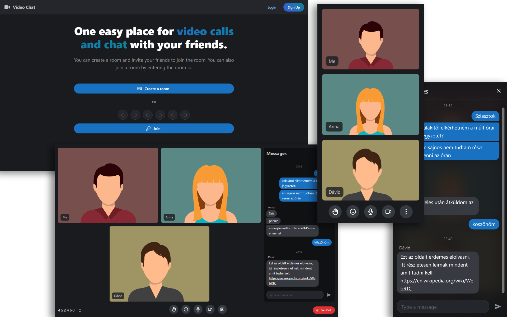

# Group Video Chat

This is a video conferencing web application. I was interested in WebRTC so for my final thesis project I choose to research this topic and create a working prototype.

On the backend I implemeneted a SFU (Selective Forwarding Unit) using Node.JS, wrtc, Socket.IO for signalling and Fastify for the rest API.

The frontend is using React, Redux, RTK Query and Mantine components.

## How to run

### Docker Compose

The `docker-compose up -d` command will build and run the containers. Afterwards you can access the app on http://localhost:8080/.

You can rebuild the containers with `docker-compose build` after changing something in the source code. To stop the running stack use `docker-compose down`.

Don't forget to change the **JWT_SECRET** variable in the `.env` file if you are hosting the application in production!